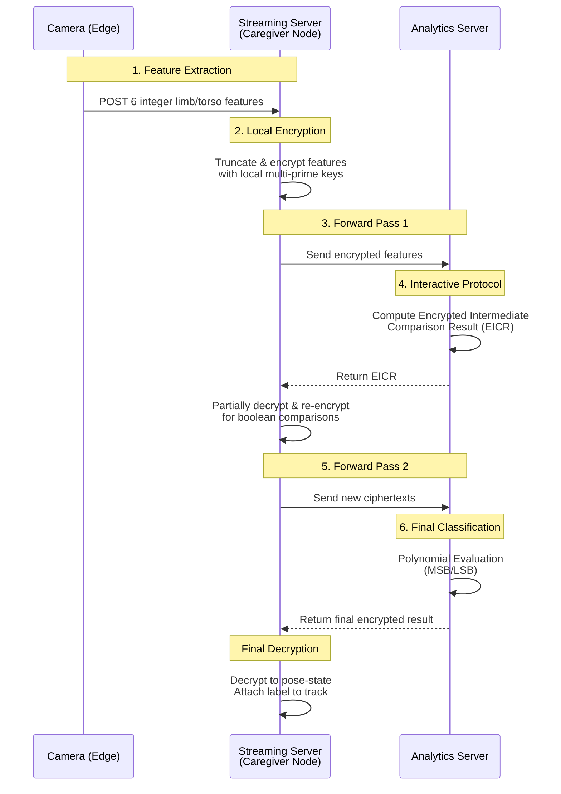

# Privacy-Preserving Patient Monitoring System - Analytics Server


The **Analytics Server** is the heavy-compute node of the Privacy-Preserving Patient Monitoring System (PPMS). It exposes a secure HTTP API to perform complex pose classification and fall detection entirely within the encrypted domain using **Homomorphic Encryption (HME)**. It acts as the remote, high-performance evaluator for the Caregiver Node (Streaming Server).

## 🔗 Related Repositories

This project is part of a distributed system:
*   [**Fall Detection Streaming Server**](https://github.com/yudhisthereal/fall-detection-streaming): The Caregiver Node (.NET 8). Handles the local encryption, acts as a high-speed state cache, and renders the synchronized UI.
*   [**Fall Detection Camera**](https://github.com/yudhisthereal/Private-Surveillence-MaixCAM): The Edge AI implementation running on MaixCAM devices (Python). Handles skeleton detection and frame uploads.

## 🏗️ System Architecture

The Analytics Server is specifically tailored to process encrypted payloads without ever decrypting or learning the underlying patient data. It functions via a synchronous, multi-round interactive protocol with the Caregiver Node.



### 1. Homomorphic Encryption (HME) Evaluation Protocol

Because complex operations (like non-linear comparisons) are natively difficult in standard HME schemes, the Analytics Server works in tandem with the local Caregiver Node using an **Interactive Protocol**.

#### Phase 1: Intermediate Results (EICR)
The Caregiver Node extracts patient skeleton features and encrypts them locally using multi-prime properties. The Analytics Server receives these encrypted features, homomorphically isolates the Most Significant Bits (MSBs), and returns an Encrypted Intermediate Comparison Result (EICR).

#### Phase 2: Polynomial Evaluation
The Caregiver Node receives the EICR, partially decrypts and re-encrypts it into a standard boolean payload to refresh noise budgets, and sends it back. The Analytics server then evaluates the final classification polynomial on these boolean metrics to determine the pose state (Standing, Sitting, Lying Down) entirely in ciphertext and returns the conclusive label.

### 2. Privacy Guarantees
*   **Zero-Knowledge Compute**: The server only performs mathematical operations on large ciphertext polynomials. It cannot render a video frame and cannot extract actual keypoint coordinates.
*   **Stateless Inference**: `POST` requests are evaluated and discarded. No tracking history linking individuals to actions is stored persistently on this node.

## 📡 API Reference

The server exposes an internal-facing REST API designed exclusively for the Caregiver Node. All endpoints are prefixed with `/api/Analytics`.

### 🧠 HME Inference Pipeline

| Method | Endpoint | Description | Body | Response |
| :--- | :--- | :--- | :--- | :--- |
| `POST` | `/compute-intermediate` | Step 1: Compute Intermediate Comparisons | Encrypted limb/torso features | Encrypted Intermediate Results (EICR) |
| `POST` | `/evaluate-polynomial` | Step 2: Final Pose Classification | Re-encrypted boolean comparison results | Encrypted Pose Label |
| `POST` | `/detect-fall` | Standard/Fallback Fall Detection Engine | Fall detection payload | `{ "status": "success", "fall_detection": bool }` |
| `GET` | `/health` | Server Health Check | - | `{ "status": "healthy", "service": "Fall Detection Analytics..." }` |

## 🚀 Installation & Dev

### 1. System Setup (Recommended)
You can set up the Analytics Server to run automatically as a highly-available systemd service using the built-in Bash script.

```bash
# Clone the repository
git clone https://github.com/yudhisthereal/fall-detection-analytics.git
cd fall-detection-analytics

# Run the automated setup (Requires sudo)
# This installs .NET 8, configures the firewall (Port 5000), and sets up systemd
sudo ./setup.sh

# During development, if you only want to rebuild the app and restart the service
sudo ./setup.sh --build-only

# Verify status
sudo systemctl status fall-detection-analytics
```

### 2. Manual Development Mode
If you prefer not to install the system service on your development machine, you can run the API directly using the .NET CLI:

```bash
cd FallDetection.Analytics
dotnet run --urls=http://0.0.0.0:5000
```

## 🔒 Security

*   **Network Isolation**: The Analytics API should logically be placed behind a firewall that only whitelists traffic originating from the known Caregiver Node (Streaming Server).
*   **Encrypted Payloads**: Requests contain no plaintext identifiers or biometric data, acting purely as numeric computations.
